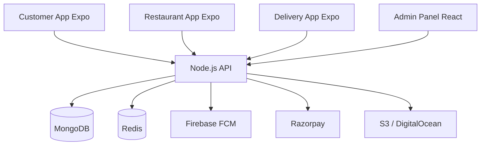

# Current Architecture

## Current State
- **Frontend Architecture:** React/Vite (Admin), React Native/Expo (Apps). State management via Zustand.
- **Backend Architecture:** Node.js API with Express. Modular folder structure (`src/modules`).
- **Database:** MongoDB for persistent storage.
- **Realtime Communication:** Socket.IO and Firebase Cloud Messaging (FCM).
- **Background Jobs:** Redis and BullMQ.
- **Payments:** Razorpay, Wallet integration.
- **File Storage:** AWS S3 / DigitalOcean Spaces.

## Architecture Diagram

## Findings
Well-separated concerns. Backend acts as the centralized broker.
