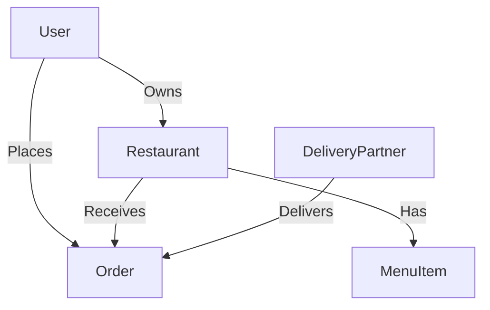

# Database Architecture

## Current State
MongoDB using Mongoose.

### Models:
- **User:** name, email, password, role (USER, RESTAURANT_OWNER, ADMIN, SUPER_ADMIN), status, addresses (Point location), fcmTokens.
- **Restaurant:** ownerId, name, cuisines, status, location (Point, 2dsphere index), documents, walletBalance, fcmTokens, registrationPayment.
- **MenuItem:** restaurantId, name, price, variants, addOns, isAvailable.
- **Order:** userId, restaurantId, deliveryId, items, totalAmount, location (Point), status, paymentStatus, paymentMethod.

## Findings
- `Restaurant.location` has a `2dsphere` index.
- `User.addresses.location` has a `2dsphere` index.
- `Order.userId` and `Order.restaurantId` are indexed.
- Missing indexes: UNKNOWN (needs deep query analysis).

## Database Relationships Diagram

## Problems
- Ensure all foreign keys (like `deliveryId`) have proper indexes.
