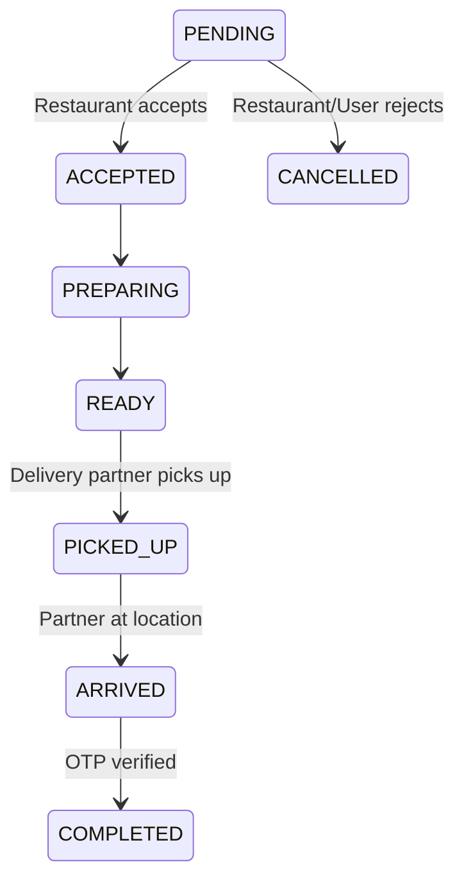

# Order System

## Current State
- **Status Enum:** `PENDING`, `ACCEPTED`, `PREPARING`, `READY`, `PICKED_UP`, `ARRIVED`, `COMPLETED`, `CANCELLED`.
- **Items:** Snapshot of items at the time of order (`menuItemId`, `name`, `price`, `quantity`).

## State Machine Diagram

## Recommended Architecture
Ensure all transitions validate the role of the user attempting the transition (e.g., only Driver can move from PICKED_UP to ARRIVED).
